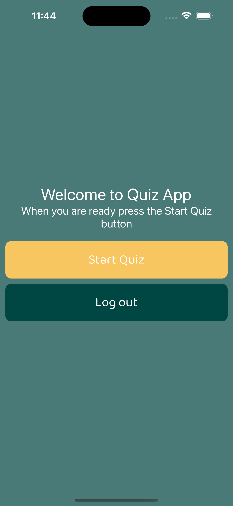
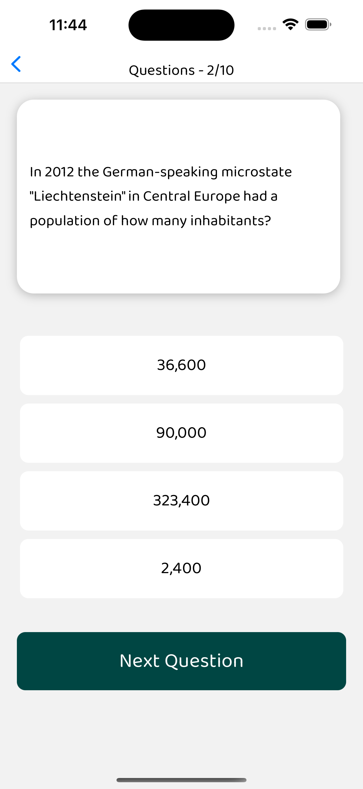

# Quiz App

## Requirements

- Install NodeJS
- GitHub

## Setup the local environment

Clone the repository

```bash
git clone https://github.com/aogallo/quiz-app.git
```

Move to the folder

```bash
cd quiz-app
```

Install the dependencies

```bash
npm install
```

## Available Scripts

In the directory, run the following command to start a development server

```bash
npm run start
```

## Screens

### Login Screen


### Welcome Screen



### Question Screen



### Finish Screen


